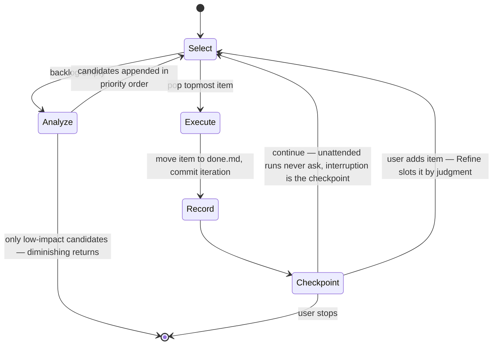

# Refine

Refine is a tool/skill/methodology for iteratively improving a repository. For now, this will focus on code, but the idea is you use Refine on a repository you own and leave it to improve it automatically and agentically in an opinionated way.

Refine is packaged as a Claude Code skill: it gets imported into a target repository as flat files (`.claude/skills/refine/SKILL.md` plus the `.refine/` backlog) and autonomously improves that repository in a loop, in the spirit of [karpathy/autoresearch](https://github.com/karpathy/autoresearch). Refine is also used to refine itself — this repository is its own first target.

## The Core Loop

1. Run deterministic and non-deterministic, quantitative and qualitative analyses on the target repository, chosen from a lens catalog scoped to what the repo actually is, and graded against a ranked maturity ladder — `maturity.md`, a living document and the source of truth for prioritization (see the skill's Analysis Phase).
2. Choose the single biggest bang-for-the-buck improvement.
3. Apply that one improvement.
4. Repeat until diminishing returns are detected or the user stops it.

As a state machine:

## Design Principles

- **One improvement per iteration.** Each loop cycle produces exactly one focused change, not a batch.
- **Opinionated.** Refine decides what "better" means; it does not ask the user to arbitrate every choice.
- **Unattended operation is the primary use case.** The user installs Refine into a personal repo, starts a remote session (e.g., from a phone), and walks away while the agent loops. Anything requiring the user to sit at a computer defeats the purpose.
- **Knows when to stop.** Diminishing returns are a first-class stopping criterion, not an afterthought.

## Model Selection

Cheap models do the mechanical work that happens constantly; strong models make the judgment calls that are rare but expensive to get wrong.

| Task | Agent | Model |
| --- | --- | --- |
| Repo recon, mechanical lens checks, backlog bookkeeping | `refine-recon` | Haiku |
| Candidate scoring and improvement selection | `refine-scorer` | Sonnet |
| Implementing the improvement | orchestrating session | session default |
| Diminishing-returns evaluation | `refine-stopper` | Opus |

The mapping lives in per-agent frontmatter (`model:` field) in `.claude/agents/refine-*.md`, which install alongside the skill; the orchestrating loop inherits the session model.

## The Backlog

Refine maintains its backlog as flat files committed to the target repo: `.refine/backlog.md` holds candidate improvements (bugs and features compete in one queue, file order is priority order), and `.refine/done.md` holds completed items. Git history is the audit trail — every backlog mutation lands in the same commit as the improvement that consumed it, and the files survive ephemeral remote sessions because they travel with the clone.

Between work items, Refine checkpoints: continue to the next item, or take a new item from the user first? New items are slotted into the priority order by Refine's own judgment. In unattended runs the checkpoint is never asked — the loop continues immediately, and interrupting it is the checkpoint.

## Installation

Refine is flat files, so installation is copying them — driven by a prompt, not a script, so it works from a phone-started remote session. In a Claude Code session in the target repo:

> Install Refine: copy the `.claude/skills/refine/` directory (SKILL.md and maturity.md) and `.claude/agents/refine-*.md` from https://github.com/wpkita/refine, seed empty `.refine/backlog.md` and `.refine/done.md`, and commit.

The skill's Analyze phase populates the empty backlog on first run. The skill has outgrown a single file, so plugin-marketplace distribution is queued in the backlog.

## Documentation Convention

This README is context. [CLAUDE.md](CLAUDE.md) is imperatives and directions.

## Current State

The skill lives at `.claude/skills/refine/` (SKILL.md plus the maturity ladder in maturity.md) and is the single source of truth for the loop — CLAUDE.md defers to it. Its Analyze phase is driven by a lens catalog: a recon pass identifies what the repo is, selects only the applicable lenses, and reads the target's own CLAUDE.md/README for repo-specific values instead of any Refine config. Findings are priced by the tiers of the maturity ladder — the source of truth for prioritization — where Tier 0 gates (secrets, license, CVEs) outrank everything and enforcement beats documentation. The model mapping is real: three bundled agents (`.claude/agents/refine-*.md`) carry it. Installation is defined (prompt-driven copy) and the repo is MIT-licensed. `.refine/backlog.md` holds what's queued; `.refine/done.md` is the audit trail. Refine is dogfooding: this repository is its own first target.
